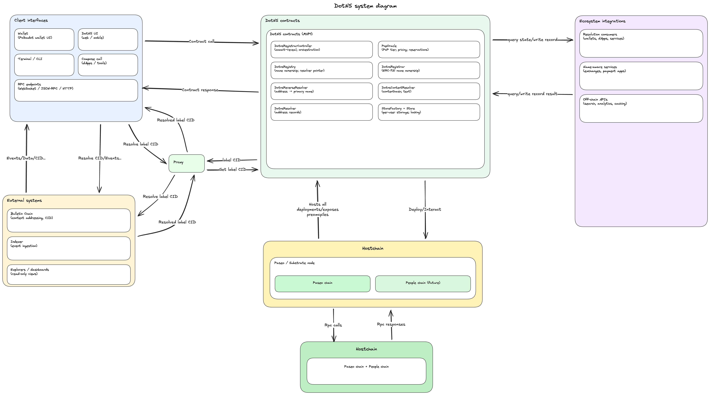

# Dotns

Smart contracts for registering `.dot` names on Polkadot.

DotNS is a naming system for Polkadot. An account can register a `.dot` name, receive an ERC721 token that represents ownership of that name, attach records to it (addresses, text, content hashes, chat keys), and create subnames beneath it. Two independent issuance paths coexist on the same underlying registrar: a public commit-reveal path for anyone who wants a name, and a Proof-of-Personhood gateway path that issues lite-person and full-person usernames on behalf of verified users. Every piece of state the protocol surfaces is readable through public view functions on the chain itself, so a client needs only a node and a small set of well-known contract addresses to answer any question about the system.

## Diagrams

### Registration flow


### Subnode creation flow


### CID flow (Bulletin Chain)


### System diagram



## Deployment note

To deploy on Paseo, and to run fork tests, you need a local ETH-RPC adapter.

A `docker-compose` file is provided. It starts the ETH-RPC adapter pointed at the live Paseo Asset Hub endpoint. We route through the adapter rather than the public RPC directly because the adapter is more stable under the traffic pattern a deploy or fork test produces; the public endpoint rate-limits and occasionally stalls, which drops mid-flight transactions and invalidates fork-test state. Anvil is not in the picture here: `forge test` spins up its own in-process EVM for unit, fuzz, and invariant tests, and fork tests run against the adapter, not against a local Anvil chain.

Start the adapter, then prepare a one-off `.env` and run one of the deployment scripts from `package.json`. The `.env` file is bootstrap input, not long-lived deployment state. The deploy script imports the configured `PRIVATE_KEY` into a Foundry keystore account when that account does not already exist, then runs the multi-stage pipeline with `--account` and `--password`. If the pipeline completes successfully, the script deletes `.env` automatically. If a stage fails, `.env` is left in place so you can correct it and retry.

```bash
cp .env.example .env
# edit .env: set ACCOUNT_NAME, ACCOUNT_PASSWORD, PRIVATE_KEY,
# WHITELIST_OPERATOR, and optionally RPC_URL
```

```bash
# fresh deploy, proxied through the adapter to the local Paseo fork
bun run deploy:anvil
```

```bash
# fresh deploy, proxied through the adapter to live Paseo
bun run deploy:testnet
```

For later non-interactive runs, reuse the imported Foundry wallet and skip `PRIVATE_KEY`:

```bash
ACCOUNT_NAME=dotns-deploy ACCOUNT_PASSWORD=... WHITELIST_OPERATOR=0xd908e5a6c88e9263f8fd0756bd0b77916008bb72 RPC_URL=xxxxx bun run deploy:testnet
```

The fresh-deploy pipeline is split across five scripts under `scripts/deploy/`, each a separate `forge script` invocation:

- `DeployCore.s.sol`: foundational name-ownership layer (store factory, registrar, reverse resolver, forward registry).
- `DeployRecords.s.sol`: per-name record layer (forward resolver, content resolver, `PopRules`).
- `DeployPolicy.s.sol`: commit-reveal controller and protocol registry.
- `DeployPopSystem.s.sol`: Proof-of-Personhood resolver and controller.
- `WireDeployments.s.sol`: authorisation and registry wire-up plus end-to-end verification. No proxy deploys.

Each stage writes the addresses it produces to a shared JSON manifest at
`deployments/<network>/<chainid>.json`; the next stage reads prior addresses
back through the same file. `scripts/deploy/run.sh` chains the stages, and
`package.json` calls into it. The split keeps each `forge script` process small
enough for OpenZeppelin's upgrade-safety validation to run without exhausting
the simulated EVM.

## Contracts

Two controllers sit on top of a single registrar and a single protocol registry. The registrar holds the ERC721 token per name; the registry holds the forward `node => (owner, resolver)` mapping and subname hierarchy; the resolvers hold per-name records; the protocol registry is the indirection layer through which every contract resolves its siblings at runtime. Controllers are the entry points: they mint names and drive the side effects. Neither controller imports the other. The layers underneath arbitrate collision handling: ERC721 uniqueness on the registrar, and a single reservation table on PopRules that both flows read through.

### `DotnsRegistrarController`

Commit-reveal controller for the public registration path. A caller first submits a commitment hash, waits out the minimum commitment age, then reveals the registration parameters alongside the payment. The controller validates the commitment, routes price and eligibility through PopRules, and orchestrates every side effect of a successful registration: the mint on the registrar, the forward wire-up on the registry, the reverse record on the reverse resolver, the immutable Store write, and any refund owed on overpayment. Acceptable input is a single DNS label; governance-reserved labels are rejected at the pricing layer.

### `DotnsPopController`

Dedicated controller for the Proof-of-Personhood gateway flow. Lives behind its own UUPS proxy with its own storage and is registered on the registrar via `addController` alongside the commit-reveal controller. Its gated entry points are callable only from the address resolved through the protocol registry under the `POP_GATEWAY` key, which is the `RootGatewayDispatcher` deployed against this controller; the dispatcher is the contract that actually proves substrate Root authority before forwarding here.

The first, `reserveBaseName`, mints a lite-person username to a user. The gateway-facing input is a `stem.suffix` shape: a single DNS label followed by exactly one dot and a digits-only suffix of at least two digits (for example `michal.03`). The controller normalises that input by stripping the dot before classification, pricing, and minting, so the on-chain label is always flat (`michal.03` becomes `michal03`). Inputs with more than one dot, no dot, or a non-digit suffix are rejected at the boundary. The call also persists the user's chat key on the PoP resolver and optionally enqueues a reservation for a full-person base name the user intends to claim later.

The second, `registerBaseName`, mints a full-person username. Whether the call is a claim against a prior lite reservation or a fresh standalone registration is derived from on-chain reservation state; the caller does not choose. The link argument selects the chat-key source: inherit from a prior lite label, or accept a fresh one in the payload. When inheriting, the call also writes the `liteLink` (full => lite) and `fullClaim` (lite => full) records on the PoP resolver in the same transaction so downstream consumers can resolve either direction without scanning events.

Each base label carries a head/tail-indexed reservation queue with a capacity of `MAX_RESERVATION_QUEUE` and a governance-configurable `reservationDuration`. The queue head is mirrored into PopRules on every head transition (enqueue-from-empty, expiry-driven promotion, non-expiry head removal, claim-wipes-queue), so the public commit-reveal flow sees the same cross-flow lock through its existing PopRules price check. Expiry advancement is permissionless: anyone can call `expireReservation` to garbage-collect a stale head, which is what the pallet does on its own cadence.

### `RootGatewayDispatcher`

Non-upgradeable shim that translates a substrate Root-origin dispatch into an EVM-observable authority on the PoP controller. The dispatcher is the direct callee of the Root runtime origin, asks the revive System precompile whether its caller is Root, and forwards the calldata to the controller via a regular message call only when that check passes. The forwarded call lands on the controller proxy with the dispatcher as the immediate caller, which the controller authorises against the address registered on the protocol registry under `POP_GATEWAY`.

Hosting the Root check in a separate, non-proxy contract is what makes it work at all. The revive System precompile is only meaningful in the frame that is the direct callee of Root, and a UUPS implementation runs inside the proxy's delegatecall, so the controller cannot ask the precompile from its own frame. The dispatcher's target is immutable, set at construction to the controller proxy it serves, and the dispatcher holds no storage of its own and never delegatecalls, so it cannot be repurposed as an arbitrary-target proxy. Rotating the dispatcher is a single `set` call on the protocol registry; the controller picks up the new gateway on its next call without an upgrade.

### `DotnsRegistrar`

ERC721-backed registrar that mints ownership of label IDs (labelhashes). Minting is restricted to every address in the `controllers` mapping; the mapping is owner-gated through `addController` and `removeController`. Every other contract in the system that needs to check "is this address authorised to drive name state?" consults this mapping rather than keeping a parallel list, which is what lets multiple controllers coexist on the same registrar without per-contract configuration changes.

### `DotnsRegistry`

Forward registry mapping `node` to `(owner, resolver)` and supporting subnode creation. When a base name is minted on the registrar, the matching controller wires the node to the new owner through this registry. Privileged node wiring defers to the same `controllers` mapping on the registrar, so both controllers can write without the registry tracking controllers of its own.

Subnames are created by the base-name owner. A subname carries its own `(owner, resolver)` and can in turn carry subnames, so the registry is the place the name hierarchy actually lives.

### `PopRules`

PoP-aware name classification and pricing. Classifies a label into one of four tiers: `NoStatus` (long labels with trailing digits, open to anyone), `PopLite` (short labels with trailing digits, requires lite-person verification), `PopFull` (labels without trailing digits, requires full-person verification), and `Reserved` (short labels governed by the protocol). The classification determines the price and the eligibility gate the commit-reveal controller enforces.

Tier assignment is read on every pricing call, not stored: `PopRules` queries the alias-accounts personhood precompile at `DotnsConstants.PERSONHOOD` with the dotns context (`bytes32("dotns")`), and translates the returned `status` byte into a `PopStatus` (0=NoStatus, 1=PopLite, 2=PopFull). Unknown tier bytes collapse to `NoStatus`, so a future precompile addition fails closed rather than silently being treated as a higher tier. There is no on-chain self-attestation; users obtain personhood off-chain through the People-chain ring proof and the alias-accounts pallet propagates the result via XCM.

Whitelisting is the exception path for users or organisations that need to register without satisfying the live PoP tier check. DotNS still does not accept self-attestation: the contracts only consume PoP status from the personhood precompile, and a user cannot set or prove their own status inside DotNS. Instead, the public registrar controller has an owner-managed whitelist for `registerReserved`, which bypasses the PoP pricing gate for approved addresses while still using the normal commit-reveal and availability checks.

To request a whitelist entry, open a `Whitelist Request` issue in this repository. The issue is labelled `whitelist-request` by the template and must include the address, address type, target network (`Paseo V2` or `Paseo Review`), and a clear description of why the PoP bypass is needed. A maintainer can approve the request by applying `whitelist-approved`, after which the workflow checks account mapping on the selected network and executes the on-chain whitelist transaction. Whitelisting does not register a name, reserve a label, or bypass ownership rules; it only allows the approved address to use the reserved registration path without a PoP status.

PopRules also holds the cross-flow reservation table for base names. Two write paths share one mapping keyed by the bare stem. The first, `reserveBaseName`, is called by the commit-reveal controller during a lite registration: it classifies the incoming label, strips the trailing digits, and writes the bare stem. The second, `reserveBaseNameForPop`, is called by the PoP controller on every reservation-queue head transition: it takes a bare stem directly and reverts when the slot is held by a different user, so the caller's local queue bookkeeping never silently diverges from the PopRules state.

Two read paths, `priceWithCheck` and `priceWithoutCheck`, are what the public flow consults. Both strip trailing digits before looking up the reservation, so any live entry on a bare stem blocks registrations of any variant under that stem for the reservation window (12 weeks by default).

### `DotnsReverseResolver`

Reverse records mapping an address to its primary name. When a name is registered, the commit-reveal controller calls the reverse resolver to set the registrant's primary name. Writes are restricted to the addresses registered under `CONTROLLER` and `REGISTRAR` on the protocol registry (the commit-reveal controller and the registrar itself); rotating either is a single `protocolRegistry.set` call. Reads are open.

### `DotnsContentResolver`

Stores `contenthash` and text records per node. This is where external content links (for example IPFS hashes) and arbitrary key-value text records (for example social handles, verification metadata) live. Writes require node ownership or an approved operator; reads are open.

### `DotnsResolver`

Stores forward-resolution address records per node. This is the conventional "name to address" lookup: a client has a `.dot` name and wants to know the Ethereum address behind it. Writes require node ownership; reads are open.

### `DotnsPopResolver`

Per-node resolver for records produced by the Proof-of-Personhood flow. Three record kinds. The chat key is ECDH public-key bytes keyed by node; it is written by the PoP controller during a lite reservation and during any claim path that inherits from a prior lite entry, and is what gives verified users an on-chain discovery channel for end-to-end encrypted messaging. The lite link answers "which lite username did this full name claim from?" and is keyed by the full-person node. The full claim is the reverse direction: it answers "which full name did this lite user claim?" and is keyed by the lite labelhash. The forward and reverse links are written by the same call, so they stay in lockstep; downstream consumers that look up by lite username (Nova's pallet, for one) resolve the full name without scanning events.

Writer authorisation is dynamic: the PoP controller address is fetched from the protocol registry on every write. Rotating the PoP controller is a single `set` call on the protocol registry with no resolver upgrade required.

### `DotnsProtocolRegistry`

On-chain lookup table mapping well-known `bytes32` keys (declared in `DotnsConstants`) to contract addresses. Every DotNS contract resolves its siblings through this registry at runtime.

Without it, each contract would store direct addresses to every contract it calls. An upgrade that changes one address would require calling `updateX()` on every contract that references it. With N contracts and M cross-references, that is M separate owner transactions per address change. The protocol registry reduces this to one: update the key in the registry, and every caller picks up the new address on its next call. The indirection also means a governance-driven rotation of, say, the PoP controller does not break any consumer that has already been deployed.

The registered keys include `REGISTRAR`, `CONTROLLER`, `REGISTRY`, `REVERSE_RESOLVER`, `RESOLVER`, `CONTENT_RESOLVER`, `POP_RULES`, `STORE_FACTORY`, `POP_CONTROLLER`, `POP_RESOLVER`, `NAME_ESCROW`, and `POP_GATEWAY`.

### `StoreFactory`, `LabelStore`, and `UserStore`

Stores are the per-user storage layer. They exist because two query paths the rest of the system needs are not answerable from anywhere else: "what names has this address ever held?" cannot be served by resolvers (keyed per-node) or the registry (live ownership only, no history), and "what user-controlled records does this address publish?" has nowhere on a resolver to live since the data is not bound to any one name. Each address gets at most one of each store, forever, and the factory is the single source of truth for which store belongs to which user.

`LabelStore` is the protocol-managed half. The registrar and the controller set write a label entry once and the slot is permanently locked. The invariant is labels only: every per-name record category (reverse, content, forward address, chat key, lite link) goes to a dedicated resolver, and the Store stays the durable per-owner registration ledger. Because entries are append-only, transferring a name writes a fresh entry on the recipient and leaves the sender's locked entry in place, so `LabelStore` doubles as the address's lifetime-of-ownership ledger while the registry continues to answer for live ownership.

`UserStore` is the user-claimed half. The bound owner is the only writer and prior values are snapshotted into a per-key history. It exists so that user-controlled records that do not belong to a name have a home that bills the user's own contract rather than polluting a shared resolver. The labels-only invariant is preserved by the split: nothing user-written ever lands on the protocol-managed side.

### Deployments

Paseo Asset Hub Previewnet

| Contract                 | Address                                      |
| ------------------------ | -------------------------------------------- |
| DotnsProtocolRegistry    | `0xc07A2F24387DA27283CD87b9F24573b74C9e0c9b` |
| DotnsRegistrar           | `0x6c40817cdb96Ab57A4d9E9fa21D0eEa8307BDDE8` |
| DotnsRegistry            | `0xE6c0fB6D5492666144A8a4a015E25a98ACa604cA` |
| DotnsRegistrarController | `0x732C38082CFAebed505A46e4e2D6414154694580` |
| DotnsPopController       | `0xfE1e25E8d521CaaA8055301CA61Ec3557263Ca76` |
| PopRules                 | `0x5f2Dd23Ee3ceD39B293701ccE8355DdDd83Cd324` |
| DotnsResolver            | `0x5E174c960F5276Bd0387F200cE42f98fe927E220` |
| DotnsReverseResolver     | `0xd5C3dcC7CE44593fEB1D72017A3539c4dB14e54a` |
| DotnsContentResolver     | `0x108376A5B6DDc6BE3201C94Fd169BE444f220076` |
| DotnsPopResolver         | `0x29Ace5d2C57109c82A30Db175e645880572c6369` |
| DotnsNameEscrow          | `0x034b072eB8AF5cEfd820390bfe239bD911174ad2` |
| StoreFactory             | `0x9C38DFec452391696a8f0D3daFE71F7Eb29e08f8` |
| LabelStoreBeacon         | `0x6B609A89Fec9898B441E17f1618670bdD08c437e` |
| UserStoreBeacon          | `0xbeb79e8BB2bC610822e8748e5439B9D890d88FF5` |


Paseo Asset Hub Next V2

| Contract                 | Address                                      |
| ------------------------ | -------------------------------------------- |
| DotnsProtocolRegistry    | `0x5Caef84563fc980178e28417414aa65bA32f6B4e` |
| DotnsRegistrar           | `0x885b8085bA92A31c4ef52076f77379E647ECC399` |
| DotnsRegistry            | `0x8877344A885682523B4613779C95688ed7037BfD` |
| DotnsRegistrarController | `0x320b72c6e70D5a631d835FfD95915B288b26E6Be` |
| DotnsPopController       | `0xaC8A28b60832E6E22bC19bD9Ee273C008576Bde4` |
| RootGatewayDispatcher    | `0xF470Dd693ED557b33f8775476776532D99Fb60d9` |
| PopRules                 | `0x2002C1c15b88632Ad01c7770f6EbE1Ca05c8472E` |
| DotnsResolver            | `0x0cCdfea1a5E62DE116BF6cA79D397798d49e351E` |
| DotnsReverseResolver     | `0x025D5c4b10bD9723DeA2F4518aeD5B761DE08CDc` |
| DotnsContentResolver     | `0x2c9FF5D9136DBE5814C7B4FDbeDC15273a776663` |
| DotnsPopResolver         | `0xB992e74cBeaf1Fd71310f85D1944d3A0c15C4c73` |
| DotnsNameEscrow          | `0x6F7068c04487a90BFB42b128B84231c252b3017a` |
| StoreFactory             | `0x0DE5De70d61cc6b44B45d6595afDe8dB9b55bc31` |
| LabelStoreBeacon         | `0xD033F7Ada687E8BC776928AB239505F9f0479Ce7` |
| UserStoreBeacon          | `0x7eD9b7D137Fa535965048F93b3B0248fEd2fcd32` |

### Build

```bash
forge build
```

### Test

```bash
forge clean
forge test
```

Fork tests run against a local Paseo Asset Hub fork and require the ETH-RPC adapter described in the deployment note. To skip them:

```bash
forge test --no-match-path 'test/fork/**'
```
